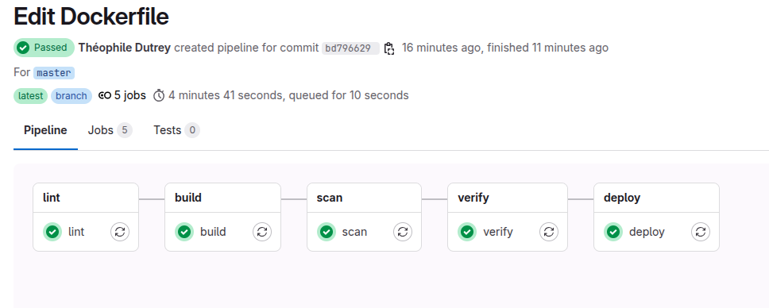
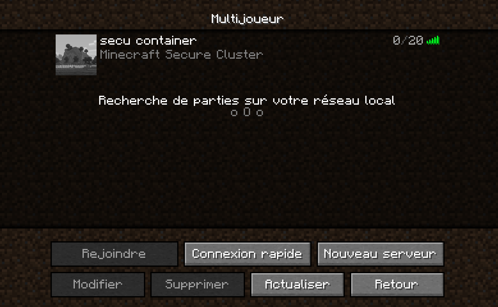
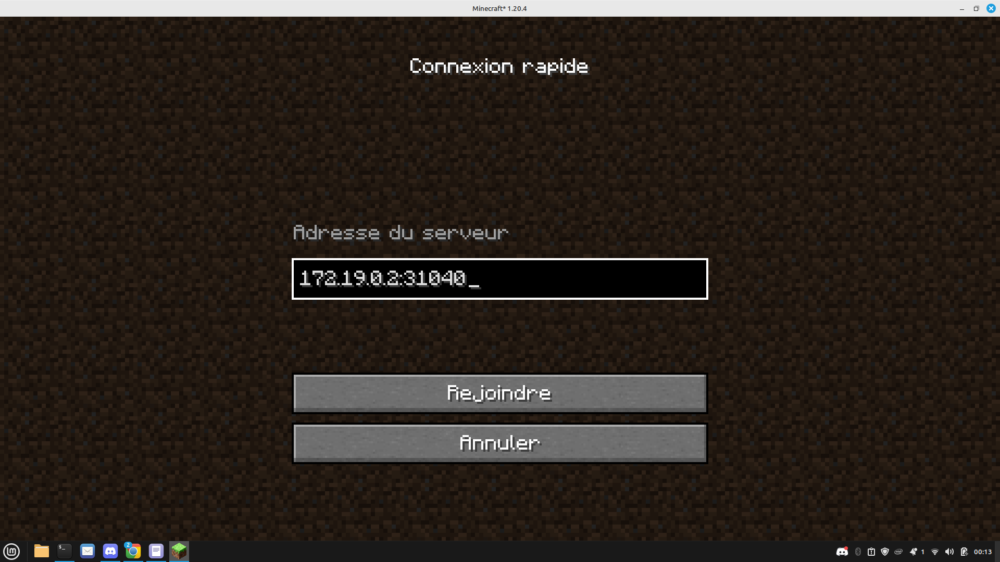
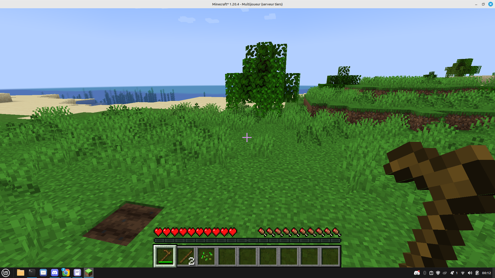
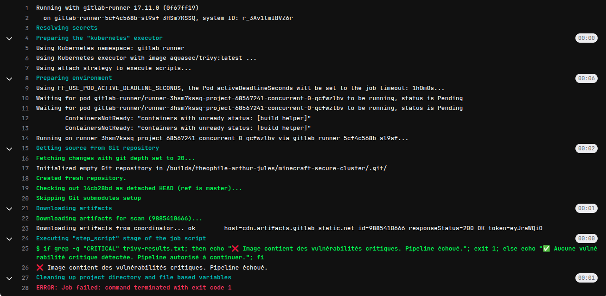

# Documentation des choix de sécurité

## 1. Dockerfile sécurisé

- **Image de base minimale** : `alpine:3.21.3` est utilisée pour réduire la surface d'attaque.
- **Utilisateur non-root** : Création d'un utilisateur `minecraft` avec permissions restreintes pour éviter l'exécution en tant que `root`.
- **Paquets épinglés** : Les versions spécifiques de `curl` et `openjdk17-jre` sont installées pour éviter l'introduction de vulnérabilités par des mises à jour inattendues.
- **Téléchargement explicite du serveur Minecraft** : Le fichier `server.jar` est récupéré depuis une source officielle (`piston-data.mojang.com`) avec contrôle des permissions.
- **Exposition du port** : Seul le port 25565 est exposé.
- **Configuration EULA** : Acceptation explicite via le fichier `eula.txt`.
- **Démarrage sécurisé** : Utilisation de paramètres Java recommandés pour la sécurité.

## 2. Contrôle d'accès avec RBAC

- **ServiceAccount dédié (`ci-deployer`)** pour les opérations CI/CD.
- **Role** Kubernetes limité aux actions nécessaires : `create`, `delete`, `get`, `list`, `watch` sur `pods`, `services`, `deployments`.
- **RoleBinding** associé à ce ServiceAccount dans le namespace `minecraft`.
- **Secret de type `kubernetes.io/service-account-token`** utilisé pour injecter le token dans le pipeline.

## 3. Pipeline sécurisé GitLab CI

- **Étapes de CI distinctes** :
  - `lint` : Vérification de la conformité du Dockerfile avec `hadolint`.
  - `build` : Construction de l'image avec `kaniko`, sans accès privilégié.
  - `scan` : Scan de l’image via `Trivy` pour détecter les vulnérabilités.
  - `verify` : Interruption conditionnelle en cas de présence de CVE critiques.
  - `deploy` : Déploiement uniquement si les étapes précédentes passent.  
  
  Exemple de pipeline réussi:
  

- **Utilisation de variables GitLab CI protégées** :
  - `CI_DEPLOY_TOKEN_K8S` pour l’authentification au cluster.

## 4. Sécurité Kubernetes

- **Namespace dédié** : `minecraft` pour isoler les ressources du serveur Minecraft.
- **Accès restreint au cluster** via RBAC.
- **Kubeconfig généré dynamiquement** dans le pipeline pour déploiement contrôlé.

---

## Capture d'écran du serveur Minecraft accessible

---

## Exemple de rejet de pipeline pour CVE critique

