# Session 1 : Introduction aux Containers et à la Sécurité

## Activités Pratiques

### 1 - Lancer un Container Simple

Executer un container de test

```bash
docker run --rm hello-world
```

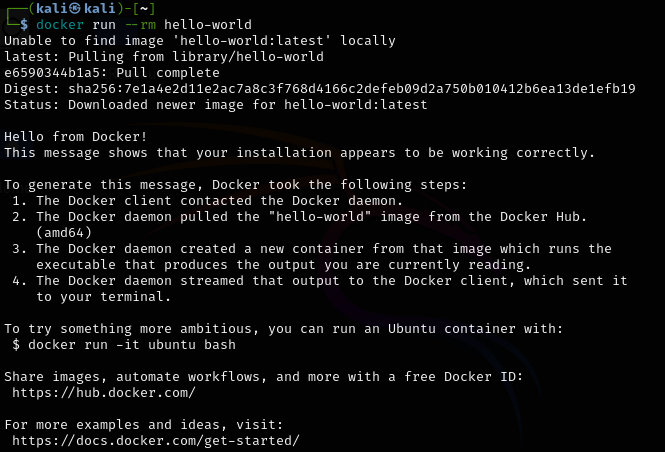

### 2 - Explorer un Container en Interactif

Lancer un container interactif basé sur alpine :
- ls (affiche l'interieur du dossier dans lequel on se trouve)
- pwd (affiche le chemin vers le dossier ou l'on se trouve)
- whoami (affiche le nom du User)

```bash
docker run -it --rm alpine sh
```

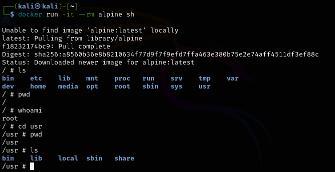

### 3 - Analyser les ressources système d’un container

```bash
docker run -d --name test-container nginx
docker stats test-container
```
La premiere commande affiche l’utilisation des ressources du conteneur en temps réel. 

Voici les données obtenues :

- **CONTAINER ID** : 1fac749d9e19

- **CPU %** : 0.03% → Très faible, ce qui est normal car Nginx est un serveur web léger et le conteneur ne traite aucune requête.

- **MEM USAGE / LIMIT** : 3.082MiB/7.762GiB → Nginx consomme environ 3 Mo de RAM sur un total de 7.7 Go disponibles sur la machine hôte.

- **MEM %** : 0.04%, la consommation de RAM est négligeable.

- **NET I/O** : 806B / 0B → Seulement 806 octets reçus et 0 octet envoyés, ce qui montre qu’il n’y a presque pas eu d’activité réseau.

- **BLOCK I/O** : 0B / 12.3kB→ Aucune donnée en lecture (0B), et 12.3 kB écrits, ce qui correspond à une activité minime, probablement des logs ou fichiers de configuration. 

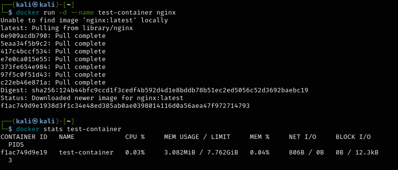

### 4 - Lister les capacités d’un container

```bash
docker run --rm --cap-add=SYS_ADMIN alpine sh -c 'cat /proc/self/status'
```

- **SYS_ADMIN donne des permission trop élevées au conteneur :** 
    - Donne des droits proches de ceux de root sur l’hôte
    - Permet d'effectuer des opérations sensibles comme : Monter/démonter des fichiers (mount), Modifier le noyau (sysctl), Gérer des espaces de noms (namespace).

- **Peut être exploité pour s'échapper du conteneur :** 
    - Pour monter le système de fichiers de l’hôte et accéder à des fichiers sensibles
    - Pour échapper à l’isolation du conteneur en modifiant les cgroups et les namespaces
    - Pour modifier la configuration du système et causer des dégâts sur l’hôte

- **Va à l'encontre des bonnes pratiques Docker :** 
    - Un des principes fondamentaux de Docker est l’isolation des conteneurs.
    - SYS_ADMIN -> on réduit cette isolation

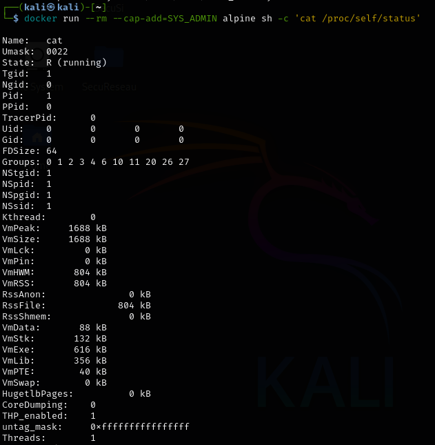
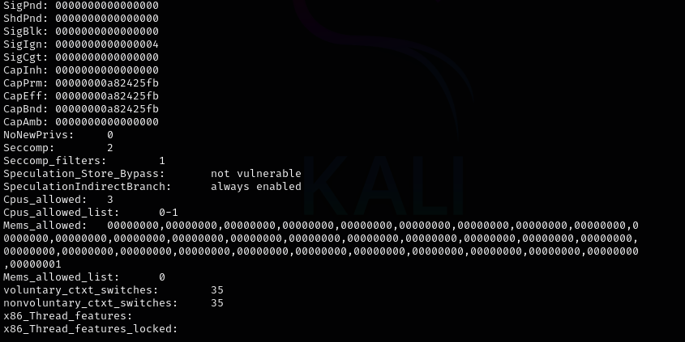

## Vulnérabilités et Menaces

### 1 - Tester un Container avec des Permissions Élevées

```bash
docker run --rm --privileged alpine sh -c 'echo hello from privileged mode'
```
- **Mode privilégié :** Le conteneur reçoit des permissions étendues, équivalentes à root sur l'hôte, lui permettant de modifier des ressources système sensibles (périphériques, modules noyau, cgroups).

- **Sécurité compromise :** L'activation de ce mode réduit l'isolation entre le conteneur et l'hôte, exposant l'hôte à des risques d'attaque (accès aux fichiers système, manipulation de périphériques, etc.).

**Dangers :**

- L'accès non restreint aux ressources hôtes augmente la surface d'attaque.

- Évasion possible du conteneur, ce qui compromet la sécurité de l'hôte.

- Contournement du principe fondamental de sécurité de Docker, basé sur l'isolation des conteneurs.

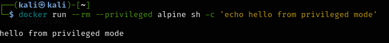

### 2 - Simuler une Évasion de Container

```bash
docker run --rm -v /:/mnt alpine sh -c 'ls /mnt'
```
Risques encourus lors d'une évasion de container :
- Accès complet aux fichiers de l'hôte

- Fuite de données et compromission

- Violation de l'isolation des conteneurs


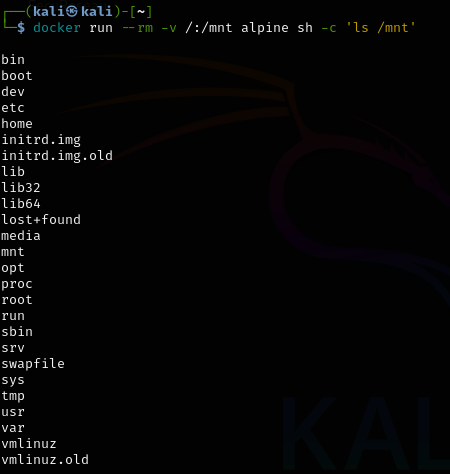

### 3 - Créer une Image Sécurisée

```bash
FROM alpine
RUN adduser -D appuser
USER appuser
CMD ["echo", "Container sécurisé!"]
```
Ici le but est de génerer une image Docker à partir du Dockerfile et la marquer avec le nom secure-container. Puis, une fois le container executé que le message "Container sécurisé!" s'affiche. Enfin il faut vérifier l'UID et l'ID de l'utilisateur.

Nous avons plusieurs étapes à faire avant que le container sécurisé soit opérationnel :

1) Créer le Dockerfile
```bash
nano Dockerfile
```
2) Construire l'image Docker
```bash
docker build -t secure-container .
```

3) Exécuter le conteneur
```bash
docker run --rm secure-container
```

4) Vérifier l'ID et l'UID de l'utilisateur appuser
```bash
docker run --rm -it secure-container sh

id appuser
```
#### On remarque alors que l'UID de l'utilisateur est 1000 et l'ID (gid) est 1000 également

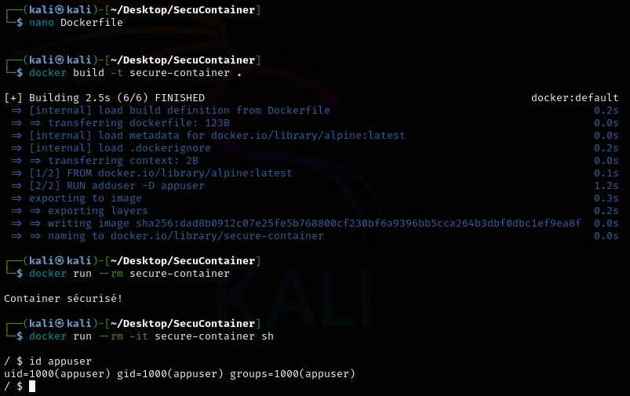


### 4 - Restreindre l’accès réseau d’un container

Afin de restreindre l'accès à internet à un container on utilise cette commande :
```bash
docker network disconnect bridge test-container
```

On remarque que le container, intialement connecté à intenet arrivait à effectuer un ping à Google.com, mais en est incapable une fois qu'il en est privé.

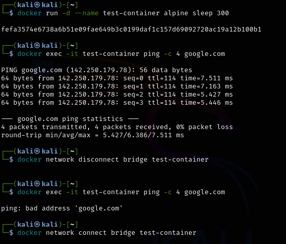

### 5 - Télécharger et Scanner une Image

Nous commençons par pull l'image web-dvwa :
```bash
docker pull vulnerables/web-dvwa
```
On scanne l'image avec Trivy :
```bash
trivy image vulnerables/web-dvwa
```
Puis on sauvegarde le resultat en JSON :
```bash
trivy image -f json -o dvwa_scan.json vulnerables/web-dvwa
```

**=>** [lien vers le Json](dvwa_scan.json)

Résumé des vulnérabilités de *vulnerables/web-dvwa* :

**Image basée sur Debian 9.5 (EOL), avec plusieurs vulnérabilités critiques :**

**Vulnérabilités critiques (CVSS ≥ 9) :**
- CVE-2019-10082 : Use-After-Free dans HTTP/2 d’Apache (exécution de code).

- CVE-2021-26691 : Débordement de tas dans mod_session d’Apache.

- CVE-2021-39275 : Écriture hors limites dans ap_escape_quotes().

- CVE-2021-40438 : SSRF via mod_proxy (contournement de restrictions).

- CVE-2022-22720 : HTTP Request Smuggling (contournement de filtrage).

**Autres vulnérabilités importantes :**
- CVE-2018-1333 : DoS via HTTP/2.

- CVE-2022-22721 : Débordement de tampon avec LimitXMLRequestBody.

- CVE-2022-23943 : Écriture hors des limites mémoire dans mod_sed.


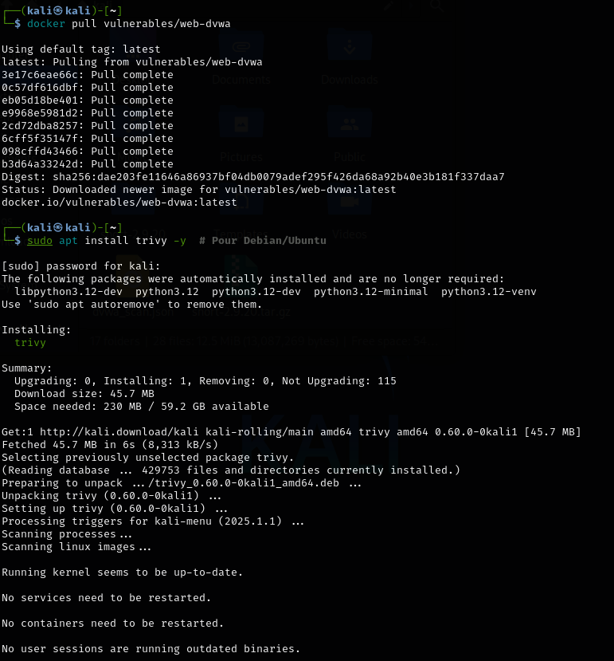

### 6 - Scanner une Image pour Détecter les Vulnérabilités

```bash
grype alpine:latest

grype vulnerables/web-dvwa
```


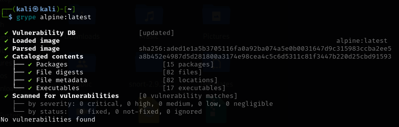
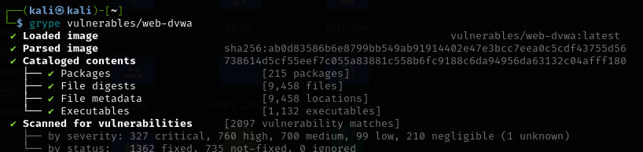

**Un tableau comparatif de Trivy et de Grype :**

| **Caractéristique**             | **Trivy**                                           | **Grype**                                           |
|---------------------------------|-----------------------------------------------------|-----------------------------------------------------|
| **Développeur**                 | Aqua Security                                       | Anchore                                             |
| **Installation**                | Binaire, Docker, intégration CI/CD                  | Binaire, Docker, utilisation de SBOM (via Syft)     |
| **Types de Scan**               | Images, systèmes de fichiers, IaC                  | Images avec analyse fine via SBOM                   |
| **Sources de vulnérabilités**   | NVD, Alpine secdb, etc.                             | NVD, Alpine secdb, etc.                             |
| **Intégration CI/CD**           | Excellente (GitLab, GitHub Actions, etc.)           | Simple à intégrer dans les pipelines CI/CD          |
| **Licence**                     | Apache 2.0                                          | Apache 2.0                                          |

Ainsi :

- **Trivy** est idéal si vous recherchez une solution complète et rapide. Il scanne efficacement non seulement les images de conteneurs, mais aussi les systèmes de fichiers et les fichiers IaC. Son installation simple et son intégration fluide dans les pipelines CI/CD en font un excellent choix pour les environnements nécessitant des mises à jour fréquentes et une large couverture des vulnérabilités.

- **Grype** est recommandé lorsque vous avez besoin d'une analyse plus fine et détaillée. Grâce à l'utilisation du SBOM (Software Bill of Materials), il offre une traçabilité approfondie des dépendances et des composants logiciels. Cela peut être particulièrement utile dans des environnements exigeant une conformité stricte et une gestion rigoureuse des vulnérabilités.


## Étude de Cas : Attaque par Élévation de Privilège

### Contexte

Dans cet étude de cas, nous examinons une attaque par élévation de privilège dans un environnement conteneurisé. Un attaquant a exploité une faille dans un container mal configuré, lui permettant d'exécuter du code sur l'hôte et de récupérer une sauvegarde de base de données contenant des informations bancaires sensibles.

### Analyse de l'Attaque

L'attaque a réussi en raison de plusieurs failles de sécurité dans la configuration et la gestion des containers :

1) **Exécution avec Privilèges Élevés :** Le container fonctionnait probablement avec des privilèges élevés, permettant à l'attaquant d'exécuter du code sur l'hôte.

2) **Capacités Système Excessives :** Le container disposait de capacités système non nécessaires, facilitant l'élévation de privilège.

3) **Mauvaise Configuration Réseau :** Les règles de réseau n'étaient pas suffisamment restrictives, permettant un accès non autorisé aux ressources sensibles.

4) **Images Non Sécurisées :** L'image du container contenait des vulnérabilités exploitables.

5) **Absence de Surveillance :** L'attaque n'a pas été détectée à temps en raison d'un manque de surveillance et de logging adéquats.

### Mesures Préventives

Pour empêcher ce type d'attaque, plusieurs mesures de sécurité doivent être mises en place :

1) **Utilisation de Containers Non Privilégiés :**
    
    - Créer des utilisateurs non privilégiés pour exécuter les applications dans les containers.
    - Exemple de Dockerfile sécurisé :
    ```bash
    FROM alpine
    RUN adduser -D appuser
    USER appuser
    CMD ["echo", "Container sécurisé!"]
    ```

2) **Limitation des Capacités du Container :**

    - Utiliser l'option ```--cap-drop``` pour retirer les capacités non nécessaires lors du lancement du container.

3) **Isolation du Réseau :**

    - Configurer des réseaux Docker personnalisés et appliquer des politiques de pare-feu strictes pour limiter les communications entre les containers et l'hôte.

4) **Scanner Régulièrement les Images :**

    - Utiliser des outils comme Trivy ou Grype pour analyser les images Docker et détecter les vulnérabilités.
    - Exemple de commande :
    ```bash
    trivy image vulnerables/web-dvwa
    ```

5) **Mises à Jour Régulières :**

    - Mettre en place un processus de mise à jour régulière des images et des dépendances pour corriger les vulnérabilités dès qu'elles sont découvertes.

6) **Surveillance et Logging :**

    - implémenter une surveillance continue des containers et des logs pour détecter les comportements anormaux.
    - Utiliser des outils de monitoring et d'alerting pour réagir rapidement en cas d'incident.

7) **Utilisation de Rootless Mode :** (voir session 2)

    - Configurer Docker pour fonctionner en mode rootless afin de réduire les risques liés à l'exécution de processus avec des privilèges élevés.

8) **Sécurisation des Sauvegardes :**

    - Stocker les sauvegardes dans un emplacement sécurisé et chiffré, accessible uniquement par des services autorisés.

### Conclusion

La mise en œuvre de ces mesures de sécurité permet de renforcer la protection des environnements conteneurisés contre les attaques par élévation de privilège. La sécurité des containers nécessite une vigilance constante et des mises à jour régulières des pratiques et des outils utilisés. En adoptant une approche proactive, les organisations peuvent minimiser les risques et protéger efficacement leurs données sensibles.


**FIN**


