# Session 2 : Bonnes pratiques pour sécuriser les containers

## Activités Pratiques

## 1 - Sécurisation du réseau

Utilisation de dockers isolés : 

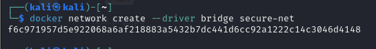

Récupération de la dernière image nginx :

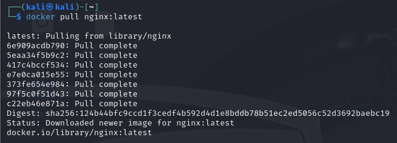

Lancement d'un container avec une restrictions sur les ports utilisés :

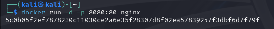

Vérification de l'exposition des ports avec `netstat` : 

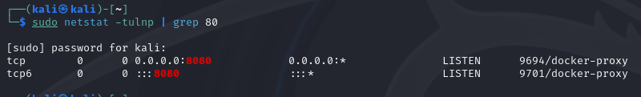

## 2 - Restreindre les permissions d’accès aux fichiers sensibles
Démarrage d'une image docker Alpine en interactif :

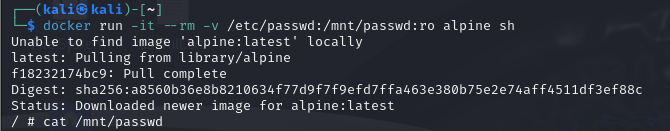

`cat` de `/mnt/passwd` :

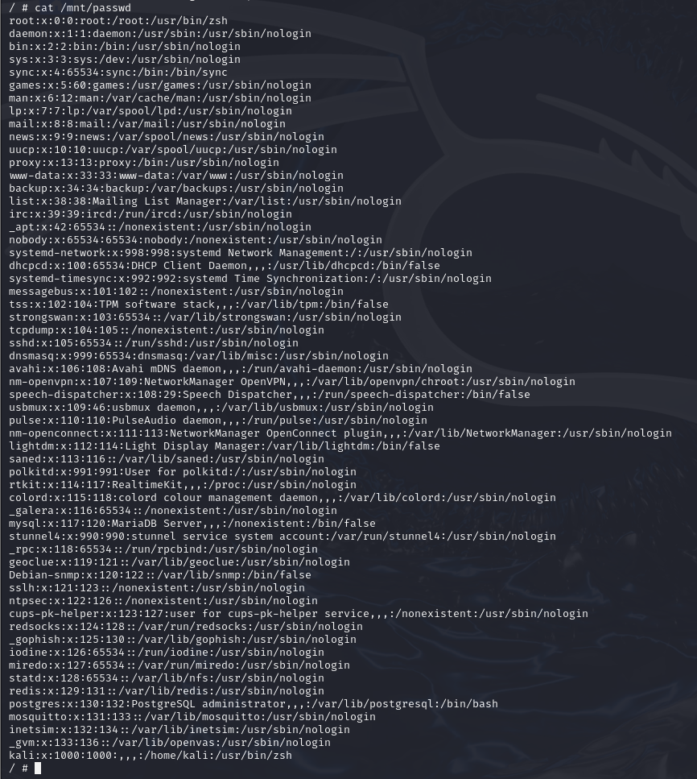

Impossible d'éditer le fichier car il est en read-only :

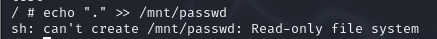

## 3 - Auditer la configuration d’un container avec Docker Bench

Téléchargement de Docker Bench for Security :

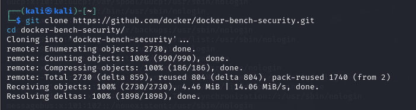

Lancement du script d'évaluation :

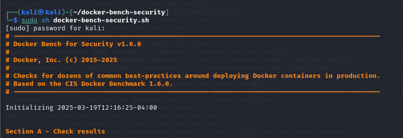

Résultat de l'évaluation : score de 6 

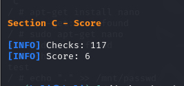

Évaluation du container `vulnerables/web-dvwa`

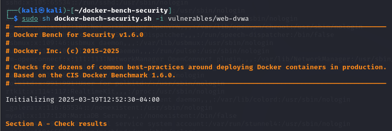

Résultat de l'évaluation : score de 2 

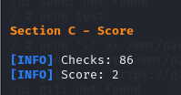

## 4 - Stocker et Utiliser des Secrets

Lancement du container `Vault` :

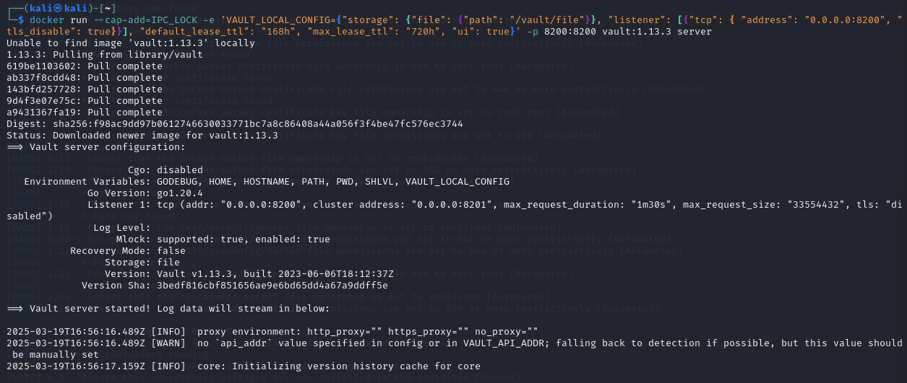

Accès à `localhost:8200` :

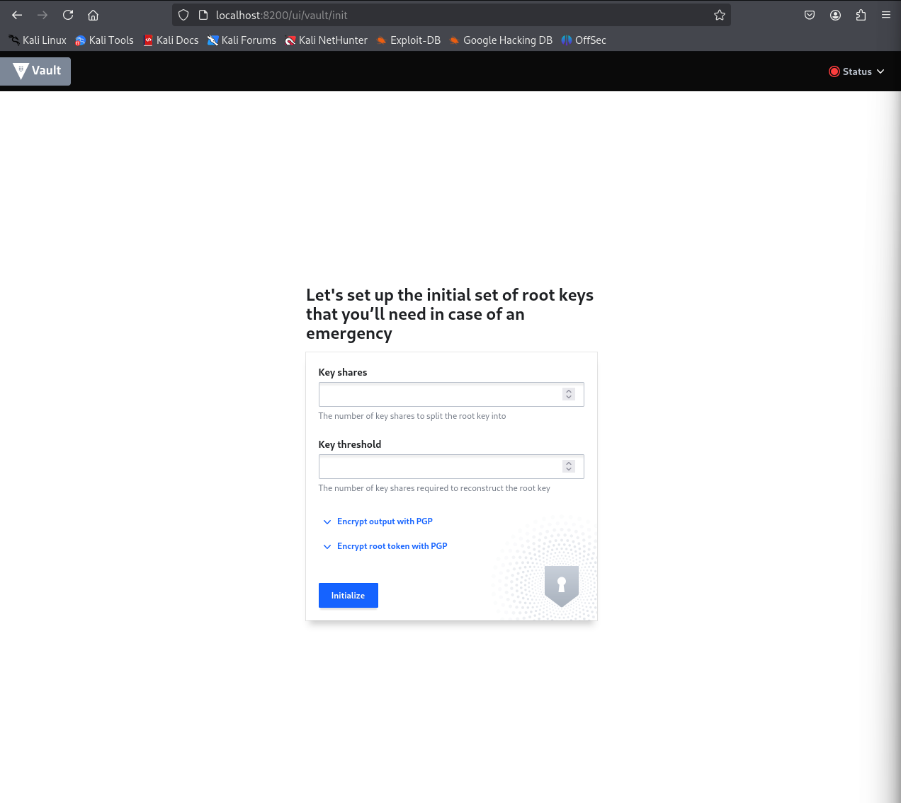

Création du root token (split en 1/1 pour la simlplicité du lab) :

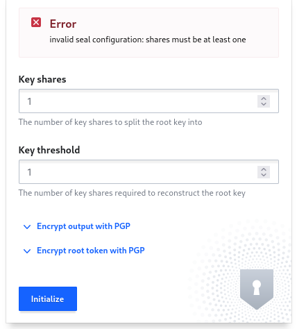

Récupération du root token et de la clé associée : 

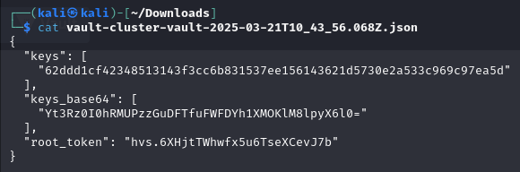

Unseal de la vault à l'aide de la clé :

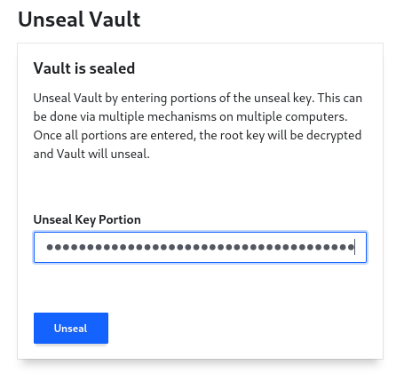

Connection à la vault à l'aide du root token :

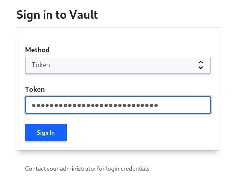

Ajout de la méthode d'authentification par combo login/mot de passe :

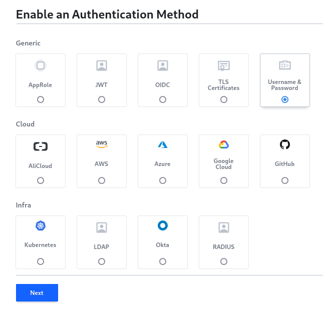

Ajout d'un utilisateur : 

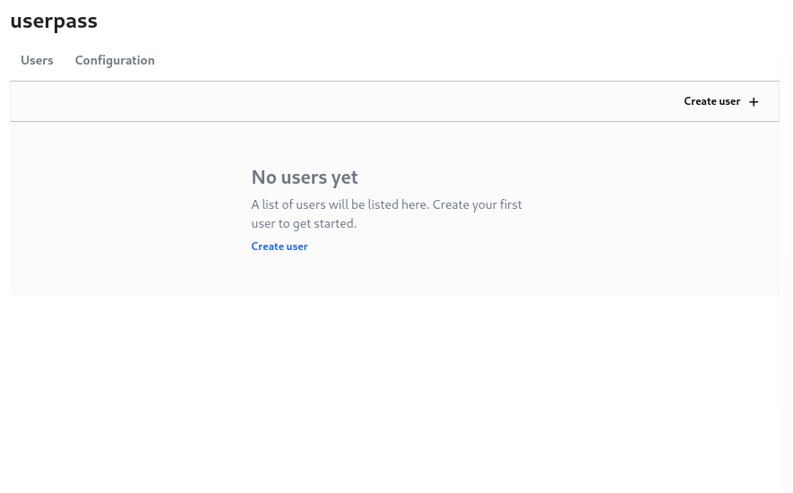

Création réussie d'un utilisateur root : 

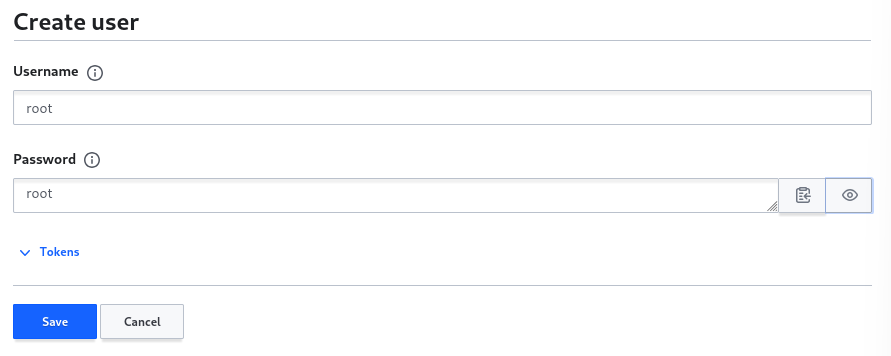

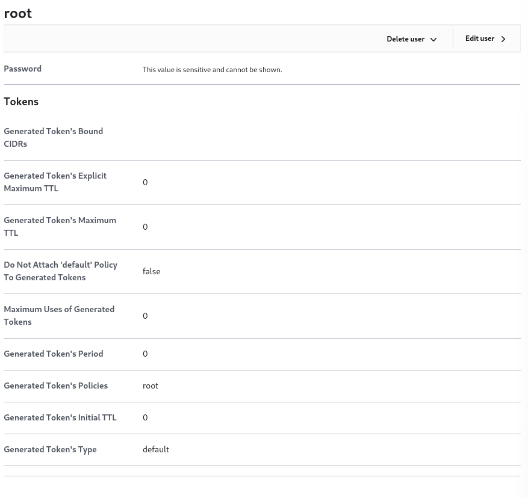

Création de la politique ACL permettant de lire le secret à l'emplacement `containers/mon-secret` :

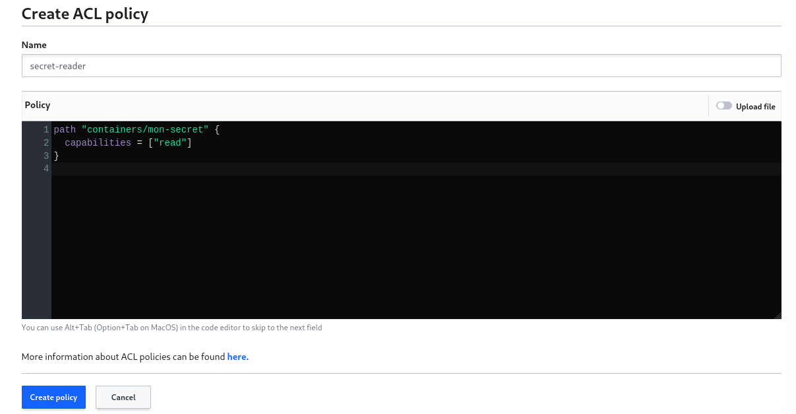

Création du 2e utilisateur :

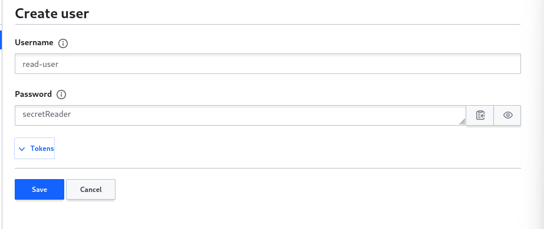

Attribution de la politique ACL au nouvel utilisateur : 

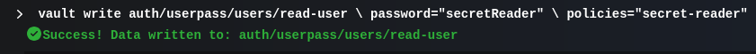

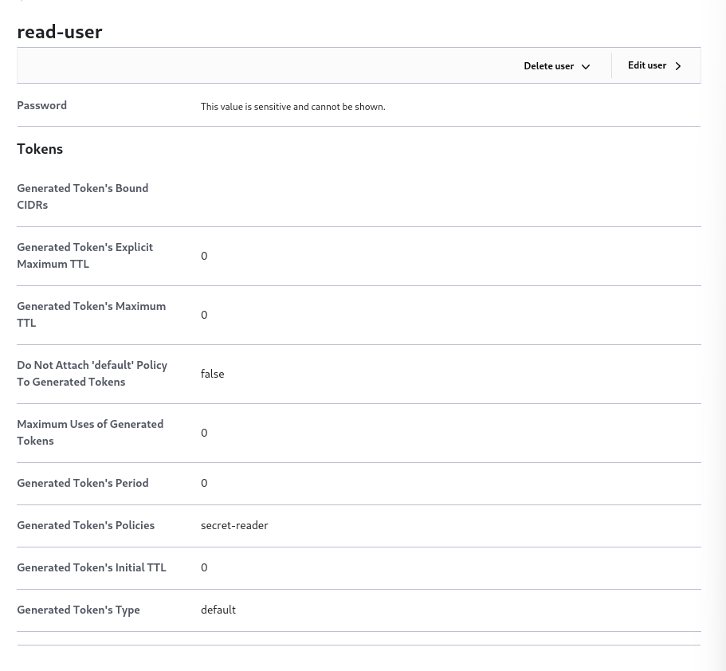

Création du secret dans le chemin `containers/mon-secret` :

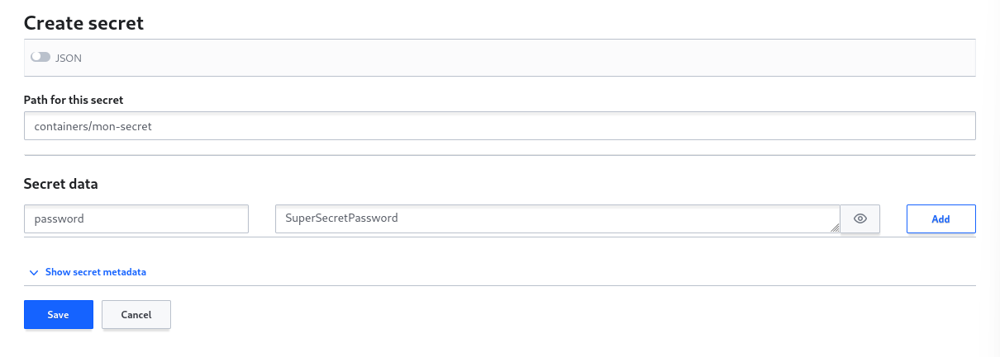

Récupération du token utilisateur depuis un container Alpine :

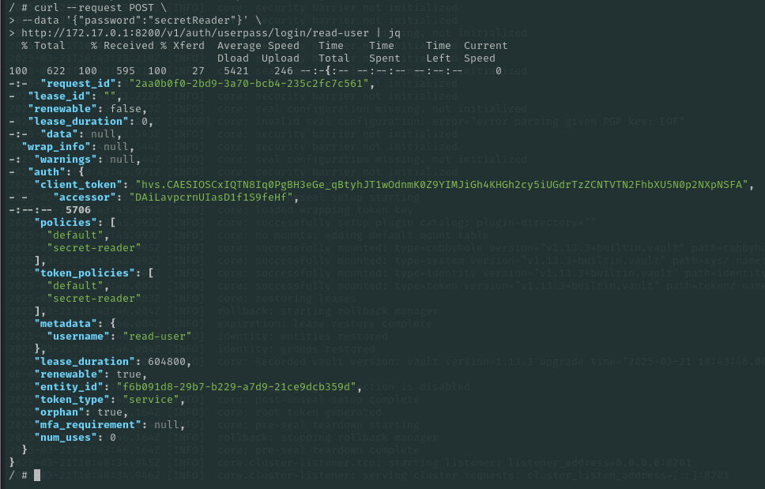

Récupération du secret à l'aide du token client :

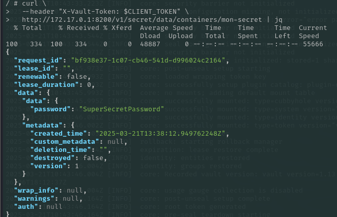

## 5 - Trouver la clé

Récupération de l'image Docker : 

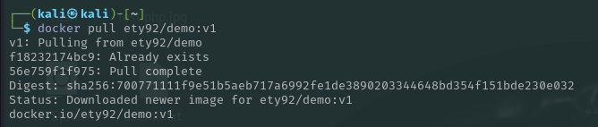

Scan de l'image avec la fonction `docker history`, on récupère la clé API ``U-never-will-saw-that``

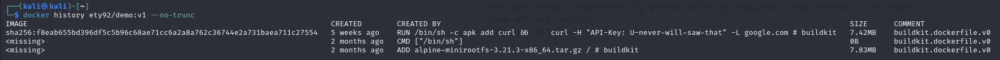

Pour éviter d’exposer la clé dans l’image et dans l’historique, il aurait fallu ne jamais l’inscrire directement dans un ``RUN`` du Dockerfile, mais la passer soit au runtime via une variable d’environnement (``docker run -e API_KEY="$API_KEY" …``), soit au build uniquement avec BuildKit (``RUN --mount=type=secret,id=api_key curl -H "API-Key: $(cat /run/secrets/api_key)" …``), ce qui permet d’utiliser la clé sans qu’elle soit stockée dans une couche et donc visible par un simple ``docker history``.

## 6 - Rootless mode

Installation de Docker en mode rootless : 

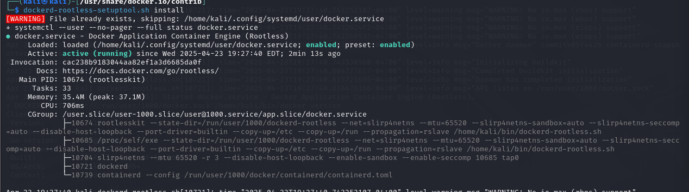

Lancement d'un container nginx : 

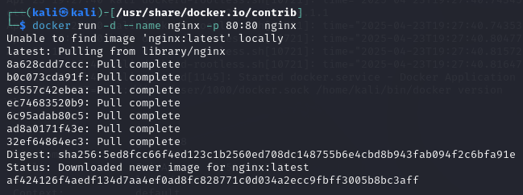

Navigation vers la page web par défaut de nginx réussie :

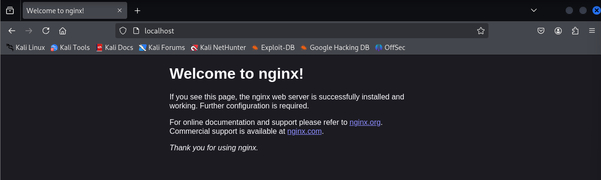

Résultat du ``docker-bench-security`` : en rootless, Docker Bench exécute moins de contrôles (105 vs. 117) car de nombreux tests liés aux privilèges système et à la configuration du noyau (iptables, auditd, cgroups, AppArmor…) ne sont tout simplement plus applicables, et le score global descend légèrement (5 vs. 6) puisque certains contrôles passent en WARN/FAIL faute d’accès root. Cela reflète bien la réduction de surface d’attaque offerte par le mode rootless, au prix d’une couverture partielle des vérifications de sécurité.

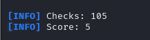

## Conclusion

Cette session a permis d'explorer et d'implémenter un ensemble complet de bonnes pratiques pour sécuriser les conteneurs Docker. À travers nos six exercices pratiques, nous avons couvert les aspects fondamentaux de la défense en profondeur pour les environnements conteneurisés :

1. **Isolation réseau** : La restriction des ports exposés réduit considérablement la surface d'attaque.

2. **Restriction des accès aux fichiers** : Le montage en lecture seule des fichiers sensibles empêche leur modification malveillante.

3. **Audit de sécurité** : L'utilisation de Docker Bench permet d'évaluer objectivement la conformité aux bonnes pratiques et d'identifier les vulnérabilités.

4. **Gestion sécurisée des secrets** : HashiCorp Vault offre une solution robuste pour stocker et accéder aux secrets sans les exposer dans les images ou variables d'environnement.

5. **Protection contre les fuites de données sensibles** : L'analyse de l'historique des images révèle l'importance d'éviter d'inclure directement des secrets dans les Dockerfiles.

6. **Mode rootless** : L'exécution de Docker sans privilèges root constitue une protection efficace contre les attaques par élévation de privilèges.

La combinaison de ces différentes techniques forme un modèle de sécurité multi-couches essentiel pour les déploiements en production. Cette approche défensive complète répond aux principales menaces qui pèsent sur les conteneurs : vulnérabilités des images, élévation de privilèges, accès non autorisés aux données sensibles et attaques réseau.

La sécurité des conteneurs n'est pas un état final mais un processus continu qui nécessite une veille technologique, des audits réguliers et l'adaptation aux nouvelles menaces. En intégrant ces pratiques dans vos workflows DevOps et en automatisant les contrôles de sécurité, vous pouvez construire des environnements conteneurisés à la fois agiles et résilients.

**FIN**

