# Session 3 : Sécurité des orchestrateurs**

## 1. Déploiement du cluster Kubernetes avec Kind

### 1.1 Configuration du cluster

Le cluster Kubernetes a été configuré à l'aide d'un fichier YAML (`kind-cluster.yaml`). Ce fichier définit l'architecture du cluster avec 2 nœuds *control-plane* et 2 nœuds *worker*. Voici la configuration utilisée :

```yaml
kind: Cluster
apiVersion: kind.x-k8s.io/v1alpha4
nodes:
  - role: control-plane
  - role: control-plane
  - role: worker
  - role: worker
```

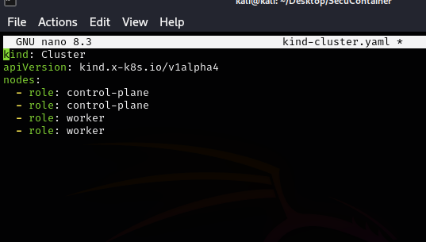

### 1.2 Création du cluster

La création du cluster a été réalisée avec la commande suivante :

```bash
kind create cluster --config kind-cluster.yaml
```

Cette commande utilise le fichier de configuration pour initialiser le cluster avec les spécifications définies.

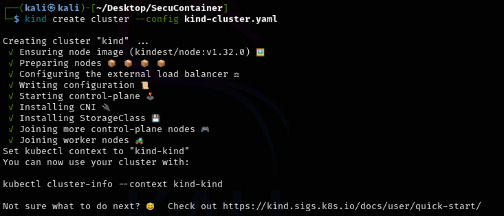

### 1.3 Vérification des nœuds

Pour vérifier que tous les nœuds ont été correctement créés et sont opérationnels, nous avons utilisé la commande suivante :

```bash
kubectl get nodes
```

Cette commande liste tous les nœuds du cluster, confirmant leur état.

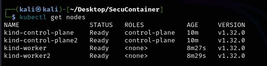

### 1.4 Namespaces par défaut

Pour afficher les namespaces existants par défaut dans le cluster, nous avons exécuté :

```bash
kubectl get namespaces
```

Cela permet de voir les namespaces système créés automatiquement par Kubernetes.

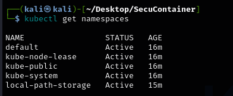


## 2. Expérimentation RBAC

### 2.1 Création du namespace `test-rbac`

Un namespace dédié aux tests RBAC a été créé avec la commande :

```bash
kubectl create ns test-rbac
```

Ce namespace isole les ressources pour les tests de sécurité.

### 2.2 Déploiement d'un Pod NGINX

Un Pod NGINX a été déployé dans le namespace `test-rbac` en utilisant le fichier `mon-pod.yaml` :

```yaml
apiVersion: v1
kind: Pod
metadata:
  name: nginx
  namespace: test-rbac
spec:
  containers:
  - name: nginx
    image: nginx
```

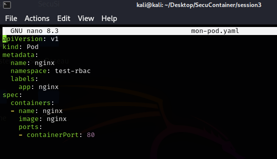

Le déploiement a été effectué avec :

```bash
kubectl apply -f mon-pod.yaml
kubectl get pods -n test-rbac
```

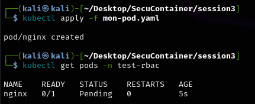

### 2.3 Consultation des logs

Pour consulter les logs du Pod NGINX, nous avons utilisé :

```bash
kubectl logs nginx -n test-rbac
```

Cela permet de vérifier que le Pod fonctionne correctement.

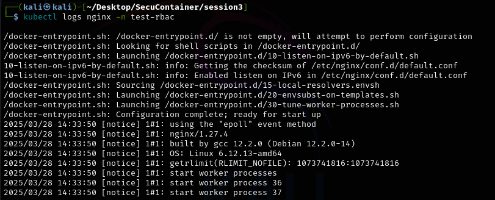

### 2.4 Création d'un Role

Un Role permettant de lire les Pods dans le namespace `test-rbac` a été créé avec le fichier `role-pod-reader.yaml` :

```yaml
apiVersion: rbac.authorization.k8s.io/v1
kind: Role
metadata:
  namespace: test-rbac
  name: pod-reader
rules:
- apiGroups: [""]
  resources: ["pods"]
  verbs: ["get", "list"]
```

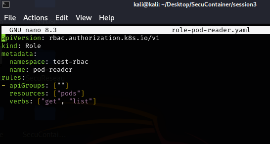

Le Role a été appliqué et vérifié avec :

```bash
kubectl apply -f role-pod-reader.yaml
kubectl get role -n test-rbac
```

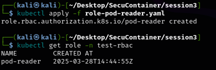

### 2.5 Création d'un RoleBinding

Un RoleBinding a été créé pour lier le Role `pod-reader` à un utilisateur fictif nommé `titi` :

```yaml
apiVersion: rbac.authorization.k8s.io/v1
kind: RoleBinding
metadata:
  name: read-pods-binding
  namespace: test-rbac
subjects:
- kind: User
  name: titi
roleRef:
  kind: Role
  name: pod-reader
```

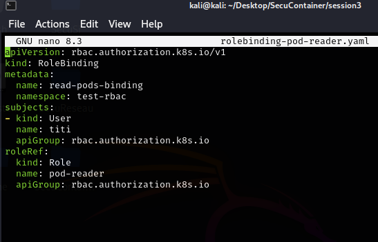

Le RoleBinding a été appliqué et vérifié avec :

```bash
kubectl apply -f rolebinding-pod-reader.yaml
kubectl get rolebinding -n test-rbac
```

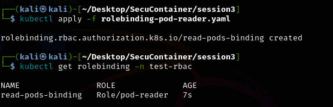

## 3. Configuration de l'utilisateur `titi`

### 3.1 Récupération des certificats CA

Les certificats CA nécessaires pour créer l'utilisateur `titi` ont été copiés depuis le conteneur `kind-control-plane` :

```bash
docker cp kind-control-plane:/etc/kubernetes/pki/ca.crt .
docker cp kind-control-plane:/etc/kubernetes/pki/ca.key .
```

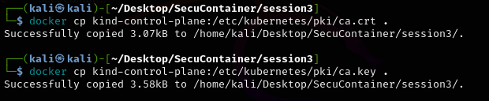

### 3.2 Génération des clés

Les clés et certificats pour l'utilisateur `titi` ont été générés avec les commandes suivantes :

```bash
openssl genrsa -out titi.key 2048
openssl req -new -key titi.key -out titi.csr -subj "/CN=titi"
openssl x509 -req -in titi.csr -CA ca.crt -CAkey ca.key -CAcreateserial -out titi.crt -days 365
```

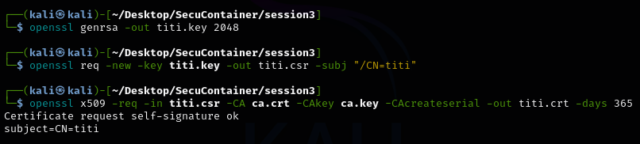

### 3.3 Ajout de l'utilisateur

L'utilisateur `titi` a été ajouté au fichier de configuration Kubernetes avec :

```bash
kubectl config set-credentials titi --client-certificate=titi.crt --client-key=titi.key
```

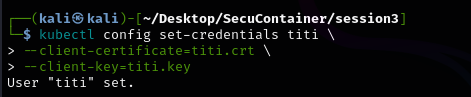

### 3.4 Création du contexte

Un contexte Kubernetes spécifique pour l'utilisateur `titi` a été créé :

```bash
kubectl config set-context titi-context --cluster=kind-kind --namespace=test-rbac --user=titi
```

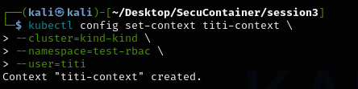

### 3.5 Changement de contexte

Le contexte a été basculé vers `titi-context` pour tester les permissions :

```bash
kubectl config use-context titi-context
```

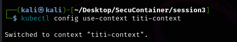

### 3.6 Test des permissions

Avec le contexte de `titi`, une tentative de création d'un Pod a été effectuée :

```bash
kubectl run test --image=nginx
```

Cette commande a échoué en raison des permissions restreintes, confirmant que le RBAC fonctionne correctement.

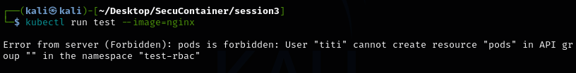

## 4. Analyse de sécurité avec kube-bench

### 4.1 Configuration du Job

Un Job Kubernetes a été configuré pour exécuter `kube-bench`, un outil d'analyse de sécurité :

```yaml
apiVersion: batch/v1
kind: Job
metadata:
  name: kube-bench
spec:
  template:
    spec:
      containers:
      - name: kube-bench
        image: aquasec/kube-bench:latest
        command: ["kube-bench"]
      restartPolicy: Never
```

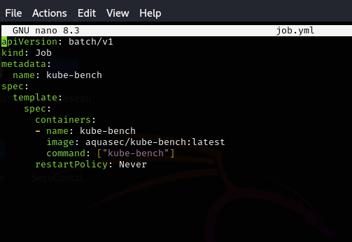

### 4.2 Exécution et logs

Le Job a été exécuté et les logs ont été consultés pour obtenir le rapport de sécurité :

```bash
kubectl apply -f job.yml
kubectl logs job/kube-bench
```

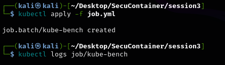

## 5. Détection d'intrusions avec Falco

### 5.1 Création du namespace

Un namespace dédié à Falco a été créé :

```bash
kubectl create ns falco
```

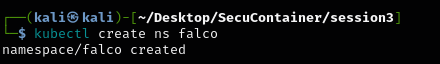

### 5.2 Installation de Falco (avec erreurs)

L'installation de Falco avec Helm a échoué en raison de problèmes de configuration :

```bash
helm -n falco install falco falcosecurity/falco --set falcosidekick.enabled=true --set falcosidekick.webui.enabled=true
```

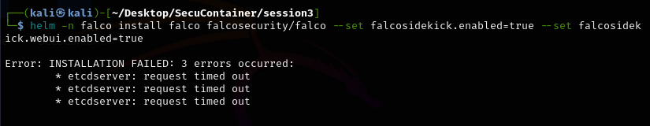

### 5.3 État des Pods

L'état des Pods dans le namespace `falco` a été vérifié :

```bash
kubectl get pods -n falco
```

Les Pods étaient en échec, indiquant un problème avec l'installation.

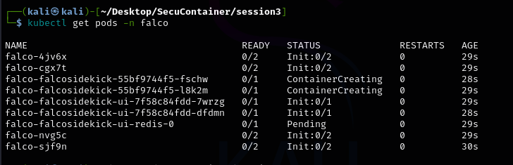

### 5.4 Accès à l'interface

Un port-forward a été configuré pour accéder à l'interface web de Falco :

```bash
kubectl port-forward svc/falco-falcosidekick-ui 2802:2802 -n falco
```

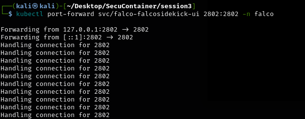

## Conclusion

Lors de cette session, nous avons rencontré des difficultés avec l'installation de Falco, ce qui a empêché le lancement correct des Pods. En conséquence, il n'a pas été possible de réaliser la dernière étape du TP, à savoir la détection et l'alerte d'intrusions dans le cluster Kubernetes. Cette expérience met en lumière l'importance de la configuration précise des outils de sécurité pour assurer leur bon fonctionnement dans un environnement Kubernetes.


**FIN**