# Session 4 : Outils de CI/CD

Lien du repo gitlab : https://gitlab.com/Atlas002/ci-secucont-lab4 

Clonage du repo gitlab :

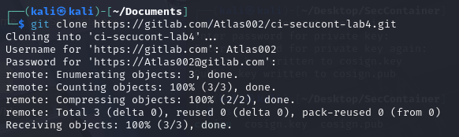

# 1 - Signature d'images avec COSIGN 

## A - Générer une paire de clés

Installation de cosign : 

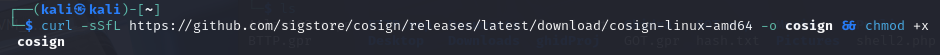

Création de la paire de clés ( passphrase : tryme )

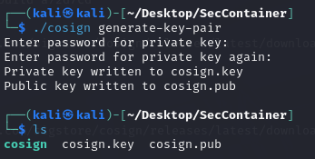

## B - Signer une image Docker et la pousser vers GitLab

Création d'un Dockerfile : 

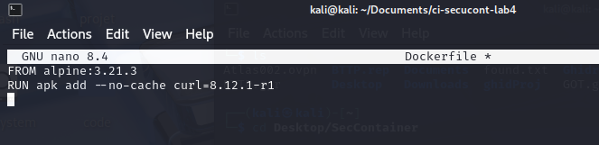

Build et tag de l'image Docker : 

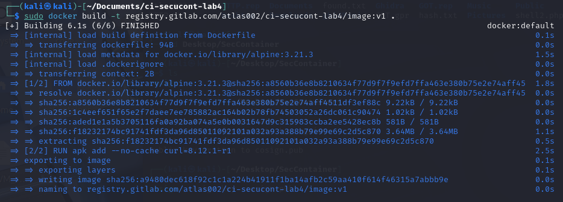

Login au docker registry :

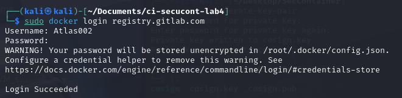

Push la V1 de l'image vers le registry : 

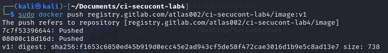

Signature de l'image V1 avec la clé privée :

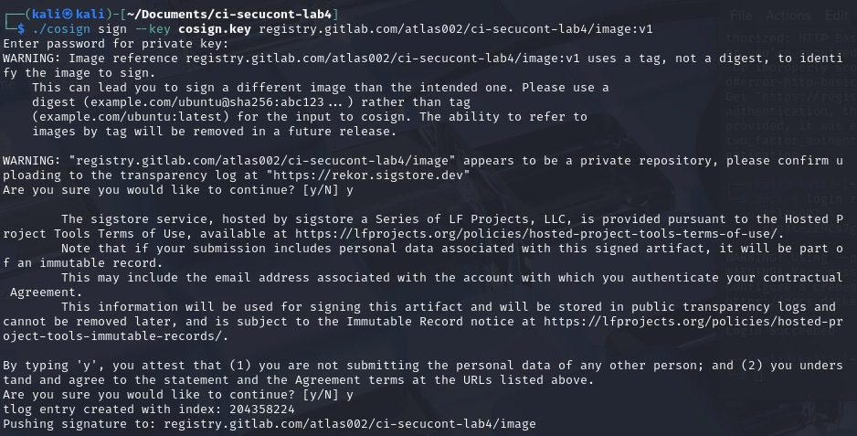

## C - Modifier l'image et pousser une version modifiée

Modification de l'image Docker : 

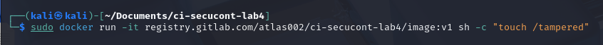

Commit de l'image modifiée en tant que V2 : 

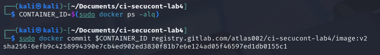

Push de la V2 dans le registry :

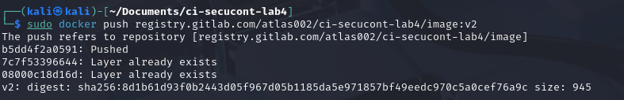

## D - Vérifier la signature avant/après modification

Vérification de la V1 de l'image : 

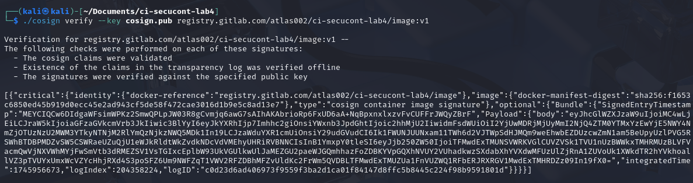

Vérification de la V2 de l'image : 

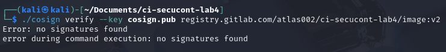

## E - Résultats des vérifications

Lors de la vérification de l’image v1, Cosign retrouve une signature valide associée à son digest : la commande renvoie l’identité du signataire et la date, confirmant que le contenu n’a pas été modifié. En revanche, pour l’image v2, Cosign détecte que le digest a changé (à cause du fichier ajouté), ne trouve aucune signature correspondante et renvoie une erreur « no signatures found », signalant une rupture d’intégrité.

# 2 - Sécurité dans les Pipelines CI/CD

Création du fichier `.gitlab-ci.yml` :

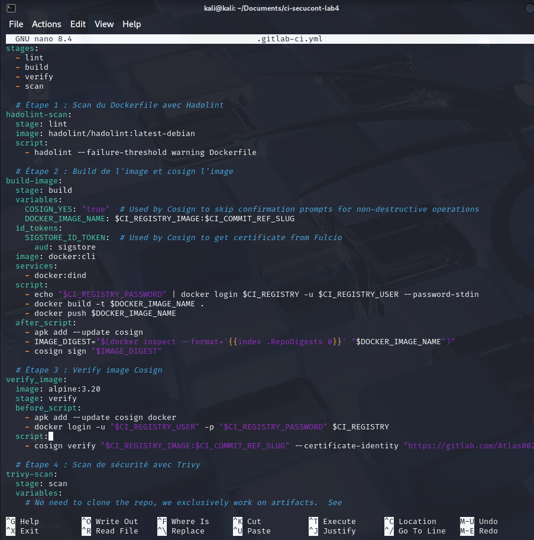

Commit et push des différents fichiers : 

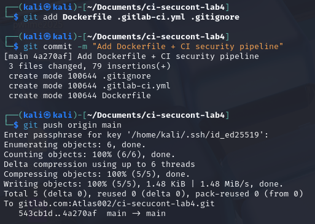

La première pipeline tourne sans encombres : 

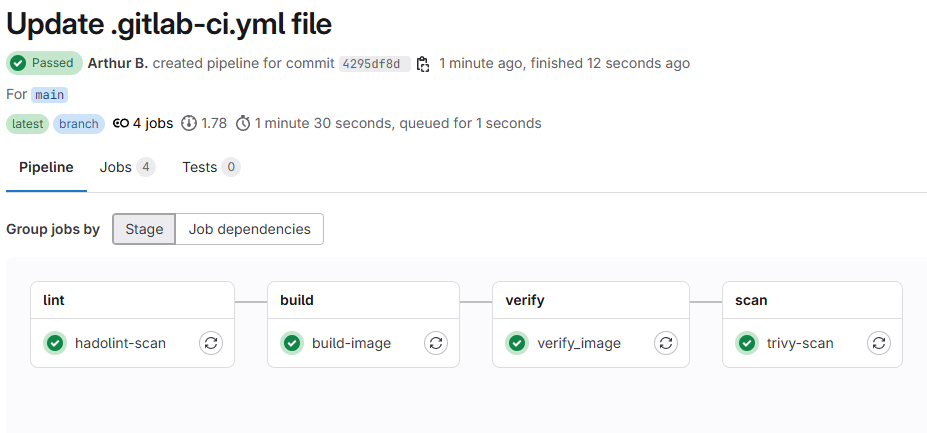

La pipeline se compose de quatre phases :

- lint (``hadolint-scan``) : analyse statique du Dockerfile pour détecter les mauvaises pratiques Docker.

- build (``build-image``) : construction de l’image, push dans le registry GitLab et signature automatique avec Cosign.

- verify (``verify_image``) : récupération et vérification de la signature Cosign afin de s’assurer qu’on ne déploie que des images intègres.

- scan (``trivy-scan``) : analyse de sécurité de l’image poussée à l’aide de Trivy, bloquant la pipeline si des vulnérabilités critiques ou élevées sont détectées.

Modification du Dcokerfile pour introduire des vulnérabilités : 

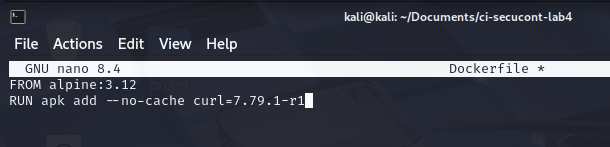

Commit et push du Dockerfile modifié : 

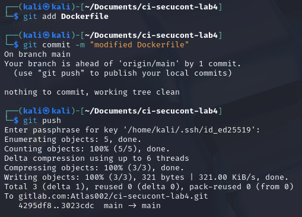

Échec de la pipeline sur la version modifiée : 

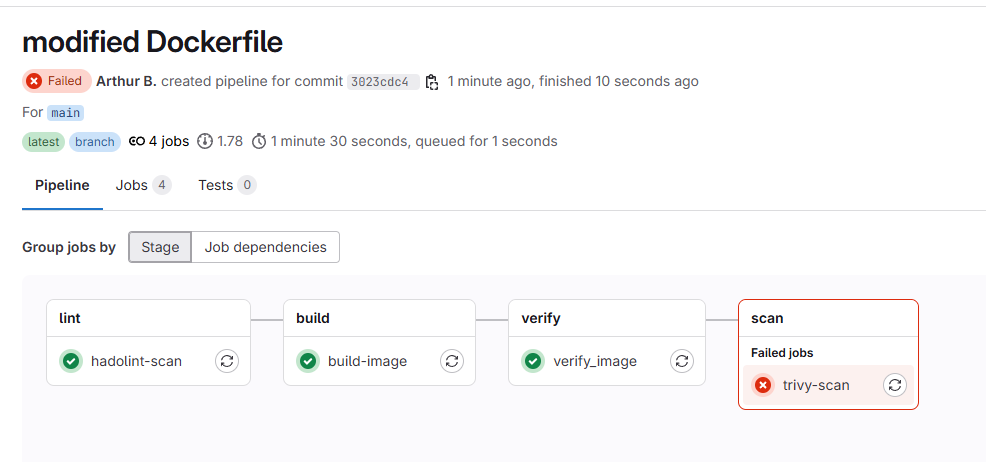

Découverte d'une cve critique par trivy : 

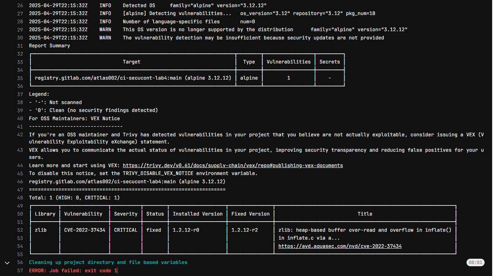

En reconstruisant l’image sur Alpine 3.12 avec ``curl 7.79.1-r1``, Trivy détecte une vulnérabilité critique dans la bibliothèque ``zlib`` (CVE-2022-37434 : heap-based buffer over-read/overflow). Le job trivy-scan rencontre ce CVE de sévérité critique, retourne un code de sortie non-nul (``--exit-code 1``) et fait échouer la phase scan, bloquant ainsi la pipeline.

# Conclusion

Cette session a permis d'explorer et d'implémenter des mécanismes cruciaux pour sécuriser le cycle de vie des conteneurs dans un environnement DevOps. Nous avons pu mettre en pratique deux aspects fondamentaux :

1. **Intégrité des images avec COSIGN** : La cryptographie appliquée aux conteneurs nous permet désormais de garantir l'authenticité et l'intégrité des images que nous déployons. La vérification de signature devient un garde-fou essentiel contre les attaques de type "supply chain" où un attaquant pourrait injecter du code malveillant dans le flux de distribution.

2. **Pipelines CI/CD sécurisées** : Notre implémentation dans GitLab CI démontre comment l'automatisation peut renforcer la sécurité plutôt que la compromettre. Grâce à une approche "shift-left", les contrôles de sécurité interviennent tôt dans le cycle de développement :
   - Analyse statique du Dockerfile avec Hadolint
   - Construction et signature automatique des images
   - Vérification cryptographique des signatures
   - Scan des vulnérabilités avec Trivy et blocage de la pipeline en cas de risque critique

Ces mécanismes constituent un exemple concret de l'approche DevSecOps, où la sécurité n'est plus une phase distincte mais intégrée à chaque étape du cycle de vie des applications conteneurisées. En combinant signature des images et pipelines CI/CD sécurisées, nous avons implémenté le principe de "confiance zéro" où chaque composant doit prouver son intégrité avant d'avancer dans la chaîne de déploiement.

L'échec intentionnel de notre pipeline face à une image vulnérable démontre l'efficacité de cette approche : bloquer le déploiement d'un conteneur potentiellement compromis avant qu'il n'atteigne l'environnement de production.

**FIN**

